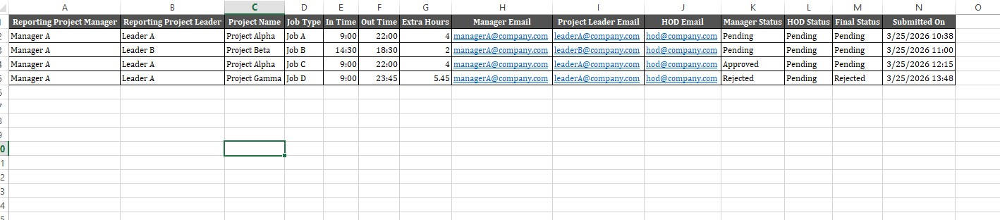

# Automated Approval Workflow using Power Automate, Excel & Outlook

## 📅 Duration
Mar 2026 – Mar 2026

## 📌 Overview
Designed and implemented an end-to-end workflow automation using Microsoft Power Automate to streamline the approval process for employee requests.

The solution integrates Microsoft Forms, Excel, and Outlook to eliminate manual intervention and improve efficiency.
## 📸 Workflow Screenshots

### 🔹 Power Automate Flow

### 🔹 Approval Tracker

---

## 🎯 Objective
- Automate manual approval process  
- Reduce email back-and-forth  
- Maintain structured and trackable data  
- Improve turnaround time for approvals  

---

## 🛠 Tools & Technologies
- Microsoft Power Automate  
- Microsoft Forms  
- Microsoft Excel (Table-based storage)  
- Microsoft Outlook  

---

## 🔄 Workflow Process

1. User submits request via Microsoft Forms  
2. Response is captured  
3. Flow triggers automatically  
4. Fetches complete response details  
5. Sends approval request to manager  
6. Includes all request details in structured format  
7. Decision Logic:
   - Approved → proceed with actions  
   - Rejected → notify requester  
8. Status updated in Excel (Approved/Rejected)  
9. Final email sent to requester  

---

## ✨ Key Features
- Fully automated approval system  
- Conditional branching (Approve/Reject)  
- Structured email formatting  
- Real-time Excel tracking  
- Error reduction & process standardization  

---

## 📊 Impact / Results
- Reduced manual effort by 60–70%  
- Minimized human errors in tracking  
- Improved approval turnaround time  
- Created centralized and transparent data system  

---

## ⚠ Challenges & Solutions
**Challenge:** Managing structured data in approval emails  
**Solution:** Used dynamic content + table formatting  

**Challenge:** Tracking approval status  
**Solution:** Integrated Excel auto-update with status column  

---

## 🚀 Future Enhancements
- Power BI Dashboard for reporting  
- Multi-level approval system  
- Automated reminders for pending approvals  

---

## 👨‍💼 Author
Aakankssha Choudharry# didactic-journey-power-automate-approval-workflow
Automated Approval Workflow using Power Automate, Excel &amp; Outlook
